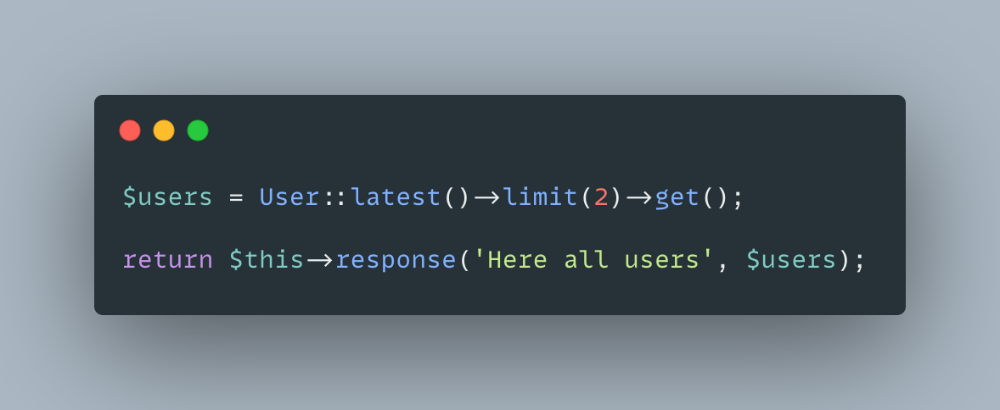
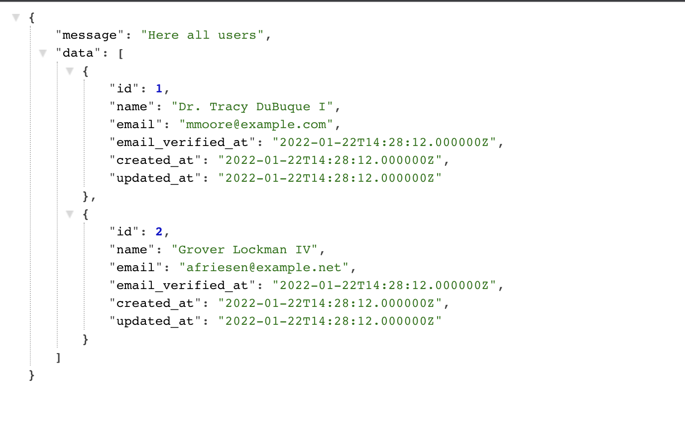
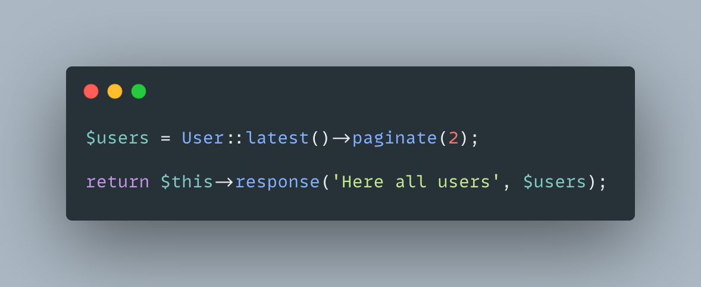
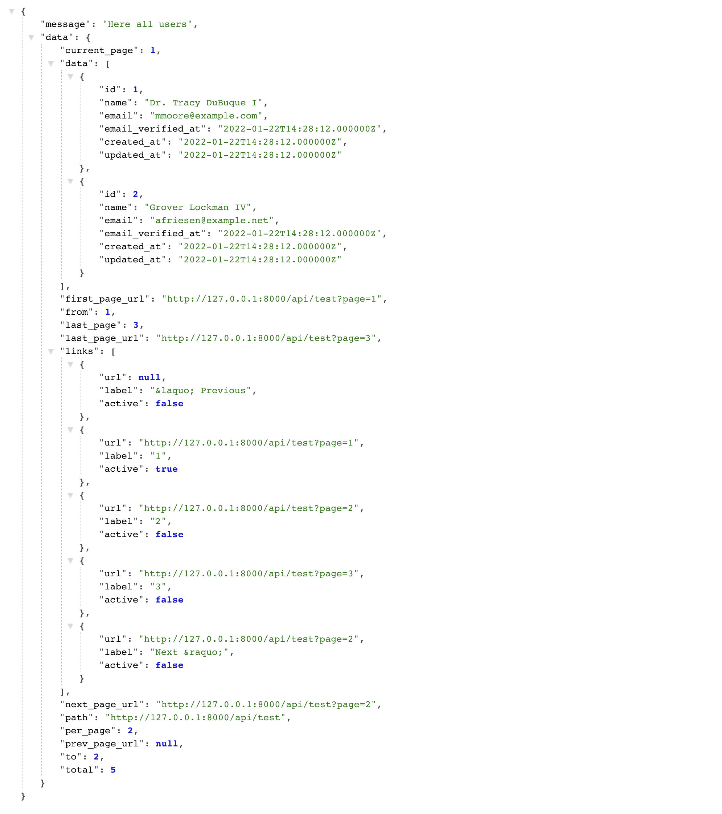
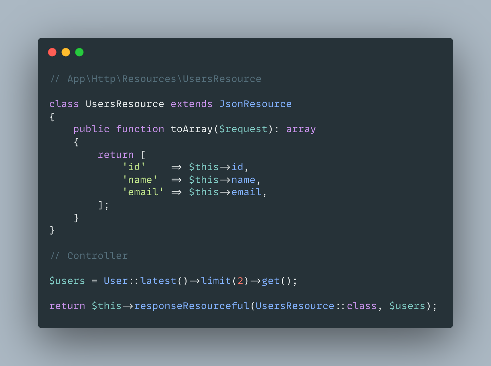
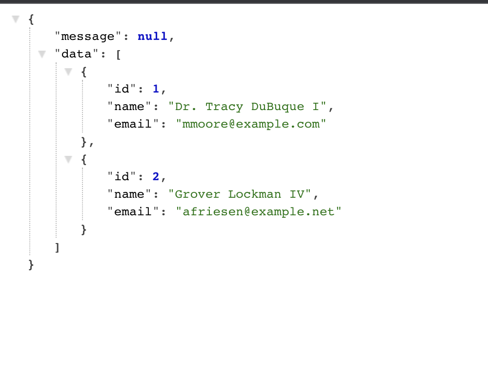
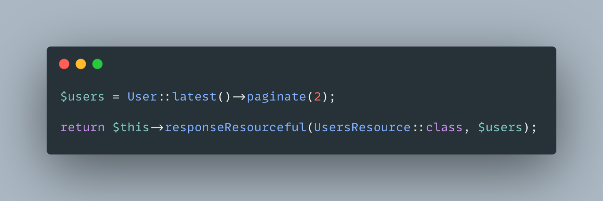
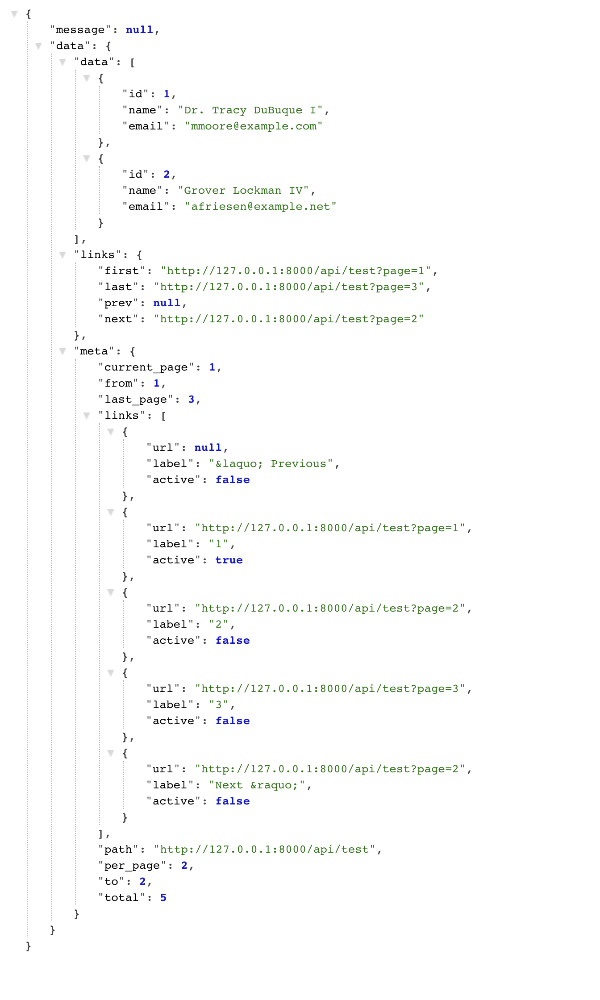

# Laravel API Response Helpers


Helpers to send API responses in same structured format. Response is always includes message and data.

```json
{
    "message": "Successfully updated",
    "data": {
        "id": 1,
        "name": "John Doe",
        "email": "johndoe@example.com"
    }
}
```

## Installation

Simply require the package via composer into your Laravel API.

    composer require lazerg/laravel-response-helpers

After that require the trait `\Lazerg\LaravelResponseHelpers\ResponseHelpers` inside of your main
controller `app/Http/Controllers/Controller.php`;

## Usage without resourceful response.

```php
    # Response with success message
    $this->responseMessage('Successfully updated');

    # Response with error message
    $this->responseMessage('Failed to update', 400);

    # Successful response with data
    $this->responseData($user);

    # Error response with data
    $this->responseData($user, 400);

    # Response with success message and data
    $this->response('Successfully updated', $user);

    # Response with error message and data
    $this->response('Failed to update', $user, 400);
```

## Usage with resourceful response

```php
    # Success response with resourceful data
    $this->responseResourceful(UsersResource::class, $users);

    # Error response with resourceful data
    $this->responseResourceful(UsersResource::class, $users, 400);

    # Success response with resourceful message and data
    $this->responseJsonResourceful(UsersResource::class, $users, 'Successfully updated');

    # Error response with resourceful message and data
    $this->responseJsonResourceful(UsersResource::class, $users, , 'Failed to update', 400);
```

## Testing

```php

$this->getJson(route('users.index'))
    ->assertOk()
    ->assertJsonCountData(5)

    # amount of $users->first()->posts
    ->assertJsonCountData(2, '0.posts')
    ->assertJsonStructureData([
        ['id', 'name', 'email']
    ]);
    ->assertJsonData([
        'id' => 1,
        'name' => 'John Doe',
        'email' => 'johndoe@example.com'
    ]);
```

## Response example

### Data without resourceful response




### Pagination without resourceful response




### Data with resource response




### Pagination with resource response



